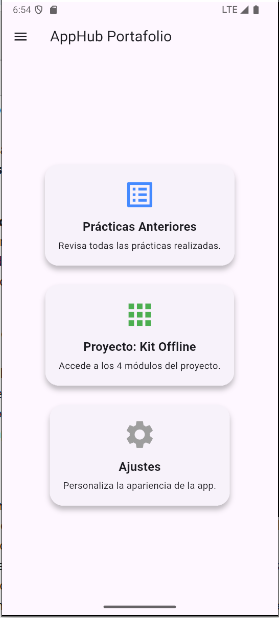
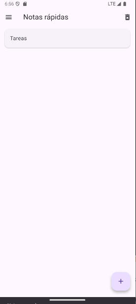
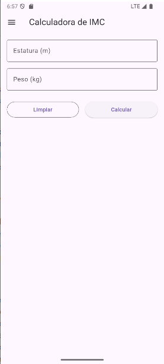
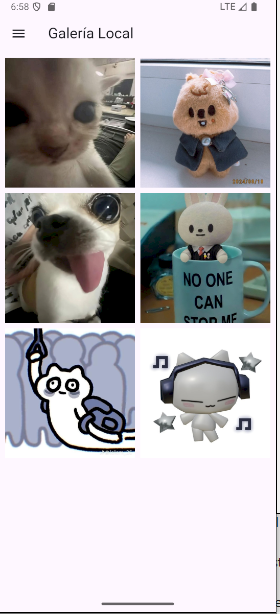
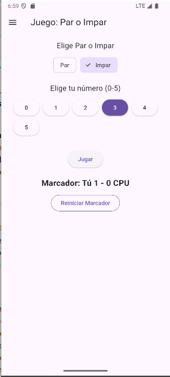
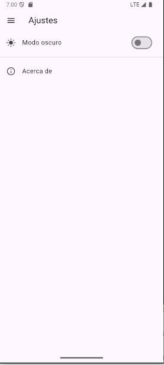
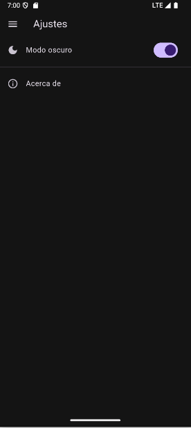
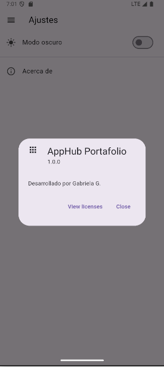

# flutter_application_1

A new Flutter project.

## Getting Started

AppHub Portafolio de Prácticas y Proyecto Kit Offline
Descripción General
Este repositorio contiene una aplicación móvil desarrollada en Flutter (Dart) que funciona como un hub centralizado para mostrar diversas prácticas de desarrollo y un proyecto modular integral (el "Kit Offline").

El proyecto se construyó con un enfoque en la modularidad, la navegación consistente y la separación de responsabilidades (cada pantalla es un archivo .dart independiente), lo que facilita su mantenimiento y expansión futura.

Componentes Clave:

Hub Principal: Pantalla de inicio con acceso rápido a las secciones principales.

Índice de Prácticas: Contiene ejercicios fundamentales (Hola Mundo, Formulario, Juego).

Proyecto Kit Offline: Módulo avanzado con cuatro funcionalidades independientes.

Menú de Navegación (Drawer): Unificado y accesible desde todas las pantallas para una navegación fluida.

Cómo Ejecutar el Proyecto
Este proyecto fue desarrollado y probado en Visual Studio Code (VS Code) con la extensión de Flutter, utilizando un emulador de Android (Android Studio).

Requisitos Previos
Tener instalado Flutter SDK.

Tener instalado Visual Studio Code o Android Studio.

Tener configurado un dispositivo o emulador Android o iOS.

Pasos de Ejecución
Clonar el Repositorio (Si aplica)

git clone [https://github.com/Gaby6U/PracticaMenu](https://github.com/Gaby6U/PracticaMenu)

cd Proyecto-AppHub-Portafolio-Kit-Offline

Obtener Dependencias

Abre la terminal en la raíz del proyecto y ejecuta el siguiente comando para descargar todos los paquetes de Flutter:

flutter pub get

Seleccionar el Emulador

Abre tu emulador de Android (o conecta un dispositivo físico).

En VS Code, presiona Ctrl + Shift + P (o Cmd + Shift + P en Mac) para abrir la paleta de comandos.

Escribe Flutter: Select Device y elige el emulador o dispositivo que has iniciado.

Alternativamente, también puedes iniciar el emulador con Shift + Control + P y después ejecutar la app.

Ejecutar la Aplicación

Abre el archivo lib/main.dart.

Presiona el botón Run (o F5) en la parte superior de VS Code o ejecuta en la terminal:

flutter run

La aplicación se cargará en el emulador o dispositivo seleccionado.

Capturas de Pantalla del Portafolio
A continuación, se muestran las pantallas principales de la aplicación para ilustrar su funcionalidad y diseño consistente:

1. Hub Principal (Inicio)
La pantalla principal que actúa como punto de partida para toda la navegación.

2. Índice de Prácticas
Muestra una lista de las prácticas realizadas, incluyendo las de "Hola Mundo", el formulario de registro y el juego de lógica.

3. Módulos del Proyecto (Kit Offline)

A. Notas Rápidas
Un módulo para añadir y gestionar notas simples.

B. Calculadora de IMC (Índice de Masa Corporal)
Permite ingresar el peso y la estatura para obtener el cálculo del IMC con retroalimentación inmediata.

C. Galería Local
Un visor de imágenes que simula el acceso a archivos locales para mostrar una galería.

D. Juego: Par o Impar
Un juego sencillo para interactuar con la lógica condicional.

4. Ajustes / Acerca de
La sección de ajustes que permite la personalización del tema (Modo Oscuro) y muestra información de la aplicación.

